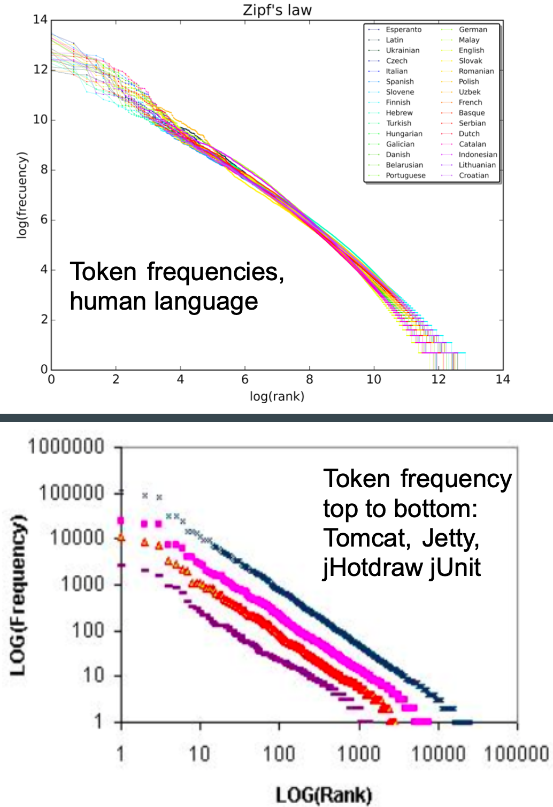

# SE for AI (a tutorial)

Tim Menzies   
timm@ieee.org  
[http://menzies.us](http://menzies.us)  
Sat Jul 31, 2021

## Scared of AI?
{.rimg150} 
Are you trapped like a deer in the headlights, frozen and terrified,
by on-coming AI software? Well, then  you are not  a software
engineer. When  SE people are worried about software, they change
it. Opaque  systems are refactored into simpler and more maintainable
code.  Complexity is removed. Simplicity is installed.

## Lets Fix  AI.
Time to start practicing  refactoring AI tools.  Start with a  simple
object model then do some mixing-and-matching  to  implement
an interesting range of functionality. Here's what you
have already (in under 500 lines of code):

- Explainable AI that generated tiny symbolic  descriptions of data;
- Single and  multi-objective  reasoning so we can handle classification,
  regression, and optimization tasks; 
- Semi-supervised learning where we guess most of the labels from 
  a few samples.
- (Well... not really. Currently,  this   is more  an aspirational
  statement. But a man's reach should exceed his grasp, or what's a
  heaven for?)

There's nothing magical about my code. Its certainly not
the absolute optimum way to implementing  all these tasks.
In fact, the best thing  I  can say about  this code is that  it
is short and easy to change. Treat it as a  challenge of
something  you  can do better than me.
To practice refactoring  AI tools, start with the
few hundreds (or so) lines  of code shown  below.
Implement
them in your  favorite language. Then
try  splashing our a little- mix and match  some  functionality.
Pull
out some code then   add in something different. 
Test that addition. See if it works better than my
stuff. Have fun with it!

And  when  you do, be a software engineering.  Try  and come up with
some  underling  object  model that lets you  handle not just your
new idea, but also a  whole product line of variations around that
idea.

## Why "Keys?"
But why is it called *keys*? Well, the "key" to simpler AI is "keys".
Many results show that  systems often exhibit the same effect
[^simple21];  i.e.  a few key features control the rest.  Just to
say the obvious, for    systems   containing a few keys, then
explanation and control is just a   matter of running a handful of
"what-if"  queries across the keys.  By exploiting the keys effect,
it us possible to dramatically simplify the development of AI
systems, as well as explaining  their inner workings.

[^simple21]:  T. Menzies, "Shockingly Simple:"KEYS" for Better AI
for SE" in IEEE Software, vol. 38, no. 02, pp. 114-118, 2021.  doi:
10.1109/MS.2020.3043014

## Less, but Better 

{.rimg300} 
One of my heroes is the industrial designer Dieter Rams.
Credited with hundreds of iconic products (everything
from the Oral-B toothbrush to home audio equipment, Braun coffee
makers to calculators), he inspired a generation of designers,
including those designing Apple products.

Rams firmly believes that "good design" involves as little design
as possible which he describe as _"Weniger, aber besser"_; which
translates to _less, but better_.

So how can we be less but better with AI?  What do we now know about
AI that we did not know before?  And how can we use that  to simplify
how we  do AI?

## Manifolds
{.rimg300} 
One lesson learned over the last two decades is that the best thing
to do with lots of data is (carefully) throw most of it away
[^strange07] [^simple21].  The reason most data mining works is
that tables of data (with many columns) can be approximated by a
lower  dimensional _manifold_ (i.e. a smaller number  of attributes)
without loss of signal.  When  data maps to a low dimensional
manifold then there are fewer ways examples can differ. When
differences are _less_ then  _continuity_ increases between nearby
examples.  So when we cluster similar examples, then we do not to
reason separately about each example.  Rather, we just cluster the
data and reason about a  few examples per cluster.

## Feature Selection
Since the underlying dimensional it of the data is
usually very small, then we can safely (and usefully)
superfluous attributes. This is called feature selection
[^kohavi95] [^hall03]:

- Weak (noisy) attributes should be removed since they can confuse 
  inference.
- {.rimg300}
  And  if we have many strong attributes that strongly associated
  with the class, then we should replace the many with just a few.
  Why? Well, if data is divided too much too soon, then sub-division
  become data starved and can make  mistakes.  <br clear=all>

## Sub-sampling 
Better yet, if we are trying to understand the difference between
neighboring clusters,  then there will very few differences. This
means we can reduce the data even more using range selection.  If
we know one particular cluster is the goal cluster, then it is silly
to divide numeric data unless it better predicts for that  goal.
For example:

- {.rimg500} 
  Shown at right is a data set where we have two clusters for red
  and blue things. The blue:red class ratio is 5:3.
- The interesting ranges are those where blue:red is very different
  to 5:3. None such exist for "pres" or "skin" (so they can be
  reduced to one  range).
- And when reasoning  about this data, if we are trying to
  predict for red, then we could ignore everything except the two
  ranges where blue is more common than red (in "plas" and "insu").

[^strange07]: Tim Menzies, David Owen, and Julian Richardson. 2007.
The Strangest Thing About Software. Computer 40, 1 (January 2007),
54–60. DOI:https://doi.org/10.1109/MC.2007.37
[^kohavi95]: Ron Kohavi and George H. John. 1997. Wrappers for
feature subset selection. Artif. Intell. 97, 1–2 (Dec. 1997),
273–324. DOI:https://doi.org/10.1016/S0004-3702(97)00043-X
[^hall03]: M. A. Hall and G. Holmes, "Benchmarking attribute selection
techniques for discrete class data mining," in IEEE Transactions
on Knowledge and Data Engineering, vol. 15, no. 6, pp. 1437-1447,
Nov.-Dec. 2003, doi: 10.1109/TKDE.2003.1245283.

## Measuring Dim
{.rimg300} 
It  is somewhat  startling  just how much little data is needed to
approximate an entire data set.  To see this, consider the following
calculation.  Suppose we (a)sort everyone's neighbors by their
distance, then plot  how (b)count how many neighbors are found  when
we go from _r_ to _2r_ to _3r_  etc (and find the maximum slope of
the log-log form of that graph). If the data is linear (one-dimensional)
or two dimensional, or three dimensional, then that slope will be
1,2,3, etc [^levina] [^yang].  For 80 data sets from the SE
domains[^seacraft] and 40 from the standard UCI repository[^uci],
those data sets  have an underlying dimensionality less than half
a dozen (for non-SE data) and even less for the SE examples.

[^levina]: Elizaveta Levina and Peter J. Bickel. 2004. Maximum
Likelihood estimation of intrinsic dimension. In "Proceedings of
the 17th International Conference on Neural Information Processing
Systems" (NIPS'04). MIT Press, Cambridge, MA, USA, 777–784.
[^yang]: Yang, X., Chen, J., Yedida, R., Yu, Z., & Menzies, T.
(2021). Learning to recognize actionable static code warnings (is
intrinsically easy). Empirical Software Engineering, 26(3), 1-24.
[^seacraft]: Seacfraft repository of SE data:  
https://zenodo.org/search?page=1&size=20&q=seacraft
[^uci]: Dua, D. and Graff, C. (2019). UCI Machine Learning Repository
http://archive.ics.uci.edu/ml. Irvine, CA: University of California,
School of Information and Computer Science.

## Low-Dim SE
Why is the SE data so less complex than data from other sources.
That is  a puzzle, but there are some promising explanations for
why  that is so:

### Low Reach
{.rimg400} 
One explanation is that when code runs, it only visits the
states approved by the combination of its internal logic -- and
this space need not be large.  For example, Zhang et al. report
that by generating tests only for the main branches in the code,
even applications that process large cloud databases can be tested
via just a few dozen inputs [^zhang20]. <br clear=all>

[^zhang20]: Q.  Zhang,  J.  Wang,  M.  A.  Gulzar,  R.  Padhye,
and  M.  Kim,  “Bigfuzz:Efficient fuzz testing for data analytics
using framework abstraction,” in the 2020 35th IEEE/ACM International
Conference on Automated Software Engineering (ASE), 2020, pp. 722–733

### Naturalness
{.rimg300} 
Another explanation is   _naturalness_; i.e. that prgramming language
have the same repetitive  properties as natural language, If a
languages that adhere to Zipf's Law, the frequency of a word is
inversely proportional to its rank in the frequency table.  That
is, the most frequent word occurs around twice as often as the
second most frequent word, three times as often as the third most
frequent word, and so on. More  generally, it means that the data
extracted from that  source is also (usually) very simple [^hindle12]
[^devanbu16]. Hence, data collected in this way have usefully
predictable statistical properties that can be captured in statistical
language models and leveraged for software engineering tasks. <br clear=all>

[^hindle12]: Abram Hindle, Earl T. Barr, Zhendong Su, Mark Gabel,
and Premkumar Devanbu. 2012. On the naturalness of software. In
Proceedings of the 34th International Conference on Software
Engineering (ICSE '12). IEEE Press, 837–847.

[^devanu16]: Abram Hindle, Earl T. Barr, Mark Gabel, Zhendong Su,
and Premkumar Devanbu. 2016. "On the naturalness of software".
Commun. ACM 59, 5 (May 2016), 122–131.
DOI:https://doi.org/10.1145/2902362

### Power Laws
{.rimg300} As to power laws, distributing drawn
from software data exhibit the long tailed distributions associated
with power laws.  To see why,  suppose programmer2  most understands
a small region  of the code written by programmer1.  That programmer
Would tend to make  most changes around  that region.  If programmer3
does  the  same  for  programmer2's code,  and  programmer4 does
the same for programmer3's code then that, over time, that team
would  spend most of their time working on a tiny portion of the
overall code base [^lin15].

[^lin15]: Z. Lin and J. Whitehead, “Why power laws? an explanation
from fine-grained code changes,” inProceedings of the 12th Working
Conference on Mining Software Repositories, ser. MSR ’15.    IEEE
Press, 2015, p.68–75.

## Deep Learning
But  what about deep learning, you might ask.  Isn't everything
improved by the use  of CPU-intensive  modeling where no one can
the model output?  Well, maybe so, but maybe  there is  too much
trust being  placed  in that one technology[^yedida21].  And  even
in that  field, some researchers are  reasoning  that finding
analogous to the above
[^lottery] [^oneclass], i.e. that DL models can be dramatically simplified.

XXX more here

[^yedida21]: R. Yedida and T. Menzies, "On the Value of Oversampling
for Deep Learning in Software Defect Prediction," in IEEE Transactions
on Software Engineering, doi: 10.1109/TSE.2021.3079841.
[^lottery]: Frankle, Jonathan and Michael Carbin. "The lottery
ticket hypothesis: Finding sparse, trainable neural networks." 7th
International Conference on Learning Representations, May 2019, New
Orleans, Louisiana, ICLR, May 2019
[^oneclass]: I.  Sucholutsky and M. Schonlau, “‘Less than one’-shot
learning: Learning N classes from M < N samples,” 2020, arXiv:2009.08449.

## Explanation

explanation is everything . better  say a bduction. enoigh ymb9lsm. "A"s have
subsets. How  find? kakas 2002. use  abduction  as a design principle
not a im-lentation principle. got to heiristics. got to
data mining. clusers

in anyc ase, what  expmanations a re not is just running a  trace.
isually a different inferences

```lua

local b4={}; for k,_ in pairs(_ENV) do b4[k]=k end
local about=[[
 ,-_|\   Contrast set learning
/     \  (c) Tim Menzies, 2021, unlicense.org
\_,-._*  Cluster, then report just the 
     v   deltas between nearby clusters.  ]]

local function config() return {
  bins= {.5     ,'Bins are of size n**BINS'},
  cols= {'x'    ,'Columns to use for inference'},
  data= {'../data/auto2.csv' 
                ,'Where to read data'},
  eg=   {""     ,"'-x ls' lists all, '-x all' runs all"},
  far=  {.9     ,'Where to look for far things'},
  goaL= {'best' ,'Learning goals: best|rest|other'},
  iota= {.3     ,'Small = sd**iota'},
  k=    {2      ,'Bayes low class frequency hack'},
  loud= {false  ,'Set verbose'},
  m=    {1      ,'Bayes low range frequency hack'},
  p=    {2      ,'Distance calculation exponent'},
  some= {20     ,'Number of samples to find far things'},
  seed= {10013  ,'Seed for random numbers'},
  top=  {10     ,'Focus on this many'},
  un=   {false  ,'Run egs, no protection'} } end
```


### asdas

as
ad
ad
asaasds
das

das

```lua

-----------------------------------------------------------
local argparse = require("argparse")
local Obj,Eg       = {},{}     -- two of the usual objects
local Skip,Num,Sym = {},{},{}  -- columns
local Row,Rows     = {},{}     -- places to store data
local goalp,klassp,nump,weight,skipp,merged,adds -- column meta
local sorted,sort,map,copy,per -- lists
local fmt,color,dump,rump,pump -- strings
local round,Seed,rand,normal   -- maths
local csv                      -- files
local run,cli,main             -- mains, unit tests

--- columns, general---------------------------------------
function goalp(s)  return s:find("+") or s:find("-") or klassp(s) end
function klassp(s) return s:find("!") end
function nump(s)   return s:sub(1,1):match("[A-Z]") end
function weight(s) return s:find("-") and -1 or 1 end
function skipp(s)  return s:find("?") end

function merged(i,j,         k)
  k= i:merge(j)
  if k:var() < (i.n*i:var() + j.n*j:var()) / (i.n + j.n) then 
    return k end end

function adds(a,i) 
  i = i or (type(a[1])=="number" and Num or Sym):new()
  for _,x in pairs(a) do i:add(x) end 
  return i end

--- Skip ---------------------------------------------------
function Skip:new(at,s) 
  return Obj.new(self,"Skip",{
    n=0, s=s or "", at=at or 0}) end
function Skip: add(x) return  x end

--- Sym ---------------------------------------------------
function Sym:new(at,s)  
  return Obj.new(self,"Sym",{
    n=0, s=s or "", at=at or 0,
    has={},mode=0,most=0}) end

function Sym:add(x)
  if x ~= "?" then
    self.n = self.n+ 1
    self.has[x] = 1+ (self.has[x] or 0)
    if self.has[x] > self.most  then
      self.most, self.mode = self.has[x], x end  end
  return  x end

function Sym:merge(other)
  new=copy(self)
  for k,v in pairs(other.has) do 
     new.n = new.n + v
     new.has[k] = v + (new.has[k] or 0) end
  for k,v in pairs(new.has) do
    if v > new.most then new.mode, new.most = k,v end end 
  return new end

function Sym:var(x,     e,p)
  e= 0
  p= function(n) return n/self.n end
  for _,v in pairs(self.has) do e=e - p(v)*math.log(p(v),2) end 
  return e end

--- Num ---------------------------------------------------
function Num:new(at,s,      w)
  s= s or ""
  return Obj.new(self,"Num",{
    n=0, s=s, at=at or 0,
    _all={}, ok=false, w=weight(s)}) end

function Num:mid() return per(self:all(),.5) end
function Num:var(   a) 
   a=self:all(); return (per(a,.9)-per(a,.1))/2.54 end

function Num:all()
  if     not self.ok 
  then   self.ok=true; self._all = sort(self._all) end
  return self._all end

function Num:add(x)
  if  x ~= "?" then
    self.n = self.n + 1
    self._all[ 1 + #self._all] = x
    self.ok= false end
  return x end 

function Num:merge(other,      new)
  new = copy(self)
  for _,v in other._all do new:add(x) end
  return new end

--- row and rows  --------------------------------------------------
```

What kind of column should be created from `s`?

```lua

function Row:new(a,rows)
  return Obj.new(self,"Row",{cells=a, rows=rows}) end

function Rows:new(inits,     x)
  x= Obj.new(self,"Rows",{
      rows={},
      cols={all={},names={},x={},y={}}})
  for _,row in pairs(inits or {}) do x:add(row) end  
  return x end

function Rows:add(a)
   a= a._name=="Rows"and a.cells or a
   if #(self.cols.names) > 0 then self:data(a) else self:header(a) end
end

function Rows:data(a)
  for _,col in pairs(self.cols.all) do a[col.at]=col:add(a[col.at]) end
  self.rows[ 1 + #self.rows] = Row:new(a,self) end

function Rows:header(a,   what,new,tmp)
  self.cols.names=a
  for at,txt in pairs(a)  do
    what = skipp(txt) and Skip or (nump(txt) and Num or Sym)
    new  = what:new(at,txt) 
    self.cols.all[1+#self.cols.all] = new
    if not skipp(txt) then
      tmp= self.cols[goalp(txt) and  "y" or "x"]
      tmp[1+#tmp] = new
      if klassp(txt) then i.cols.klass = new end end end end

--- lists --------------------------------------------------
function sorted(t,         i,keys)
  i,keys = 0,{}
  for k in pairs(t) do keys[#keys+1] = k end
  table.sort(keys)
  return function ()
    if i < #keys then
      i=i+1; return keys[i], t[keys[i]] end end end

function sort(a,f)
  table.sort(a, f or function(x,y) return x<y end)
  return a end

function map(a,f,     b)
  b, f = {}, f or function(z) return z end
  for i,v in pairs(a or {}) do b[i] = f(v) end 
  return b end 

function copy(obj, seen,      s, res)
  if type(obj) ~= 'table' then return obj end
  if seen and seen[obj] then return seen[obj] end
  s = seen or {}
  res = setmetatable({}, getmetatable(obj))
  s[obj] = res
  for k, v in pairs(obj) do res[copy(k, s)] = copy(v, s) end
    return res end

function per(a,p) 
  return a[math.max(1,math.floor(#a*(p or .5)))] end

--- strings -----------------------------------------------
function fmt(s,...) return io.write(s:format(...)) end 

function color(s,...)
  local x={red=31, green=32, yellow=33, purple=34}
  print('\27[1m\27['..x[s]..'m'..string.format(...)..'\27[0m') end

function dump(o,     sep,s)
  sep, s = "", (o._name or "") .."{"
  if (#o > 0) then
    for i=1,#o do
      s=s .. sep .. tostring(o[i])
      sep=", " end 
  else
    for k,v in sorted(o) do 
      if k:sub(1,1) ~= "_" then
        s=s .. sep .. tostring(k).."="..tostring(v)
        sep=", " end end end
  return s.."}" end

function rump(t,pre,    indent,fmt)
  pre, indent = pre or "", indent or 0
  if indent < 10 then
    for k, v in pairs(t or {}) do
      if not (type(k)=='string' and k:match("^_")) then
        fmt= pre..string.rep("|  ",indent)..tostring(k)..": "
        if type(v) == "table" then
          print(fmt)
          rump(v, pre, indent+1)
        else
          print(fmt .. tostring(v)) end end end end end

function pump(o) print(dump(o)) end

--- maths -------------------------------------------------
function round(num, decimals,      mult)
  mult = 10^(decimals or 0)
  return math.floor(num * mult + 0.5) / mult end

function normal(mu,sd)
  local sqrt, log, cos, pi = math.sqrt, math.log, math.cos, math.pi
  return mu+sd*sqrt(-2*log(rand()))*cos(2*pi*rand()) end

Seed = 10013
function rand(lo,hi,     mult,mod)
  lo,hi = lo or 0, hi or 1
  mult, mod = 16807, 2147483647
  Seed = (mult * Seed) % mod 
  return lo + (hi-lo) * Seed / mod end 

--- file --------------------------------------------------
function csv(file,       split,stream,tmp)
  stream = file and io.input(file) or io.input()
  tmp    = io.read()
  return function(       t)
    if tmp then
      tmp = tmp:gsub("[\t\r ]*",""):gsub("#.*","")
      t={}; for y in string.gmatch(tmp, "([^,]+)") do t[#t+1]=y end
      tmp = io.read()
      if #t > 0 then
        for j,x in pairs(t) do t[j]=tonumber(x) or x end
        return t end
    else
      io.close(stream) end end end

function Obj.new(self, name, new)
  new = new or {}
  setmetatable(new, self)
  self.__tostring = dump 
  self.__index    = self
  self._name      = name
  return new end

function cli(what,about,t,       arg,b4)
  arg = argparse(what, about)
  for flag,v in sorted(t) do
    flag = "--"..flag
    b4 =" (default: "..tostring(v[1])..")"
    if     v[1]==false
    then   arg:flag(flag, v[2],  v[1])
    elseif type(v[1])=="number"
    then   arg:option(flag, v[2]..b4, v[1],tonumber)
    else   arg:option(flag, v[2]    , v[1]) end end 
  return arg:parse() end

--- main -------------------------------------------------
function run(txt,fails,the,      it)
  the  = copy(the)
  Seed = the.seed
  it   = Eg[txt]
  if     the.un==true 
  then   print("unsafe:"); it.fun(the)
  elseif pcall(function () it.fun(the); end)
  then   color("green","✔ % -15s  %s",txt,it.txt); fails=fails+0
  else   color("red",  "✘ %-15s  %s" ,txt,it.txt); fails=fails+1 end 
  return fails end

function main(the,      fails)
  fails= 0
  if     the.eg=="all"
  then   for txt,meta in sorted(Eg) do
           fails=run(txt, fails, the) end 
  elseif the.eg=="ls" 
  then   print("\neegs:")
         for x,y in sorted(Eg) do fmt("  %-15s  %s",x,y.txt) end 
  elseif the.eg and Eg[the.eg] 
  then   fails = run(the.eg, fails, the) end
  for k,_ in pairs(_ENV) do if not b4[k] then print("?? "..k) end end
  os.exit(fails) end

--- unit tests ---------------------------------------------
Eg.sorted= {
  txt = "sorting items",
  fun = function(_) 
         for x,y in sorted{mm=10,zz=2,cc=3,aa=1} do 
           return assert(x=="aa" and y==1)  end end}

Eg.map= {
  txt="meta map functions",
  fun=function(_,  f) 
        f= function(z) return z*2 end
        assert(40 ==  map({10,20,30},f)[2]) end}

Eg.copy= {
  txt="deep copy",
  fun=function(_,        a,b) 
               a={1,{2,{3,{4},5},6},7}
               b=copy(a)
               a[2][2][2][1]=10 
        assert(b[2][2][2][1]==4)   end}

Eg.num={
  txt="number",
  fun=function(_,     n)
        n=Num:new()
        for i=1,10000 do n:add(round(rand(),2)) end
        n:var() end }
        
Eg.rand={
  txt="random numbers",
  fun=function(_,      a)
        a={}
        for i=1,10 do a[1+#a] = round(rand(),2) end 
        pump(sort(a)) end}
        
Eg.meta={
  txt="meta",
  fun=function(_)
        assert(      goalp( "word+"))
        assert(nil== goalp( "word"))
        assert(      klassp("word!"))
        assert(nil== klassp("word"))
        assert(      nump(  "Word"))
        assert(nil== nump(  "word"))
        assert(-1 == weight("word-"))
        assert( 1 == weight("word+"))
        assert(      skipp( "word?"))
        assert(nil== skipp( "word")) end}
                
Eg.num={
  txt="num",
  fun=function(_,    mu,sd,eps, n,num)
        num=Num:new()
        n,mu, sd, eps = 1000, 10, 1, .05
        for i=1,n do num:add(normal(mu,sd)) end
        assert(math.abs(sd - num:var()) < eps)
        assert(math.abs(mu - num:mid()) < eps) end }

Eg.sym={
  txt="sym",
  fun=function(_,        e0,e1,eps)
        e0, eps = 1.3787834, 0.0001
        assert(0==adds({"a","a","a","a"}):var())
        e1 =adds({"a","a","a","a","b","b","c"}):var()
        assert(math.abs(e1 - e0) < eps) end }

Eg.csv={
  txt="csv",
  fun=function(the,       t)
        t = Rows:new()
        for row in csv(the.data) do t:add(row) end
        rump(t.cols.all[2])
      end}
-----------------------------------------------------------
main( cli("./keys", about, config()) )

```
